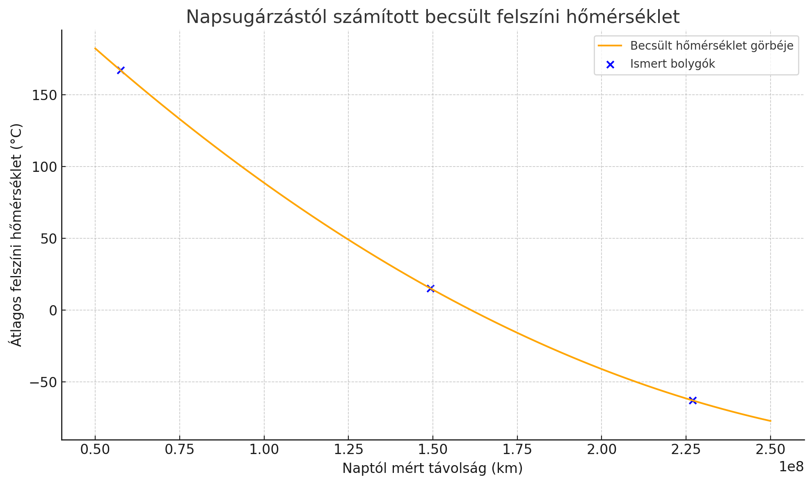

# ThreeJS - Worker

## Steps to make worker works in a new project

1. Add `_workers` folder with `threejs.worker.ts` in it.
2. Add `tsconfig.worker.json` in a new project
    - IMPORTANT! Don't place it into `tsconfig.app.json`
    - it has to contains the following data:
    ```json
    {
        "extends": "./tsconfig.json",
        "compilerOptions": {
            "outDir": "./out-tsc/worker",
            "types": [
                "node"
            ],
            "lib": [
                "es2020",
                "webworker"
            ]
        },
        "include": [
            "src/**/*.worker.ts"
        ]
    }
    ```
3. Add this row to `angular.json` in `projects/{projectname}/architect/build/option`:
    ```json
    "webWorkerTsConfig": "tsconfig.worker.json"
    ```

## Connect worker with Angular
First of all you have to install the following packages:
```sh
npm i three
npm i offscreen-canvas
```

After that you have to implement the following codes
- `app.component.html`
    ```html
    <canvas id="canvas"></canvas>
    ```

- `app.component.ts`
    ```ts
    ngAfterViewInit() {
        this.worker = new Worker(new URL('src/app/_workers/threejs.worker.ts', import.meta.url));

        //...

        var hasOffscreenSupport = !!htmlCanvas.transferControlToOffscreen;
        if (hasOffscreenSupport) {
            var offscreen = htmlCanvas.transferControlToOffscreen() as any;

            this.worker.postMessage({ canvas: offscreen }, [offscreen]);

            // send random event

            htmlCanvas.addEventListener('mousemove', (event: any) => {
                if (this.worker) {
                    this.worker.postMessage({
                        type: 'mousemove',
                        mouseX: event.clientX,
                        mouseY: event.clientY
                    });
                }
            });
        }
    }
    ```

- `threejs.worker.ts`
    ```ts
    const insideWorker = require("offscreen-canvas/inside-worker");
    const THREE = require('three');

    insideWorker((event: any) => {
        if (event.data.canvas) {
            const canvas = event.data.canvas;

            const renderer = new THREE.WebGLRenderer({ canvas: canvas });

            // threejs code...

            // example for event handling
            self.onmessage = function (event) {
                if (event.data.type === 'mousemove') {
                    const mouseX = (event.data.mouseX / canvas.width) * 2 - 1;
                    const mouseY = -(event.data.mouseY / canvas.height) * 2 + 1;
                    
                    object.position.x = mouseX * 5;
                    object.position.y = mouseY * 5;
                }
            };
        }
    });
    ```

## References

[1] Konva worker implementation. https://github.com/bbarn3y/2022-2023-2-korszeru-angular-alkalmazasok

[2] Worker setup. https://github.com/bbarn3y/2023-2024-2-korszeru-angular-alkalmazasok/commit/f325aa3a581967ca0da9adf869d865e4d2fa381e

[3] Worker with ThreeJS. https://github.com/naotaro0123/three-ts-csg-practice/blob/b1b8e7ce66600caeca7281532efd5ac7db9f9757/src/Workers/OffScreenWorker.ts

[4] Offscreen canvas inside webworker. https://konvajs.org/docs/sandbox/Web_Worker.html


# S3L

- [x] https://discourse.threejs.org/t/how-to-enable-fps-counter-within-the-three-js-web-editor/33030
- [x] terhelés - a háttérben mennyi CPU-t eszik (webworkerben lehet nézni?)
- [x] Föld object, ami egy ellipszis pályán mozog
- [x] Összefoglaló a témabejelentőhöz
- [x] Szakdolgozat leírás módosítása
- [x] Más API keresése
- [x] Árnyék szemben a nappal
- [x] Textúrák módosítása
- [x] Vonal a pályán
- [x] Kapcsoló - eltűnjön a vonal
- [x] lensflare
- [x] GPU-CPU mérés javítása
- [x] változtatni a fókuszt más bolygókra
- [ ] NASA API vizsgálata
- [ ] Statikus elliptikus pálya
- [ ] jelenlegi bolygópozíció lekérése
- [ ] resize canvas reload
- [ ] Még több user interaction
- [ ] exobolygók számítása - milyen hőmérséklet lehet rajta, mennyire lehet terraformálni
- [ ] Ezeknek az optimalizálása
- [ ] lerp camera moving

- [ ] források kigyűjtése

# 2024.11.


https://github.com/spite/THREE.MeshLine


háttér gömb felbontásának beállítása
bolygók textúrájára is hatással lehet
    le fogja skálázni a 8k-s képet is
    filter beállítása, amikor a texturát beállítottuk
    nem gömbre feszítették ki - valami más
    sokkal világosabb teszt közben, textura betöltésénél és beállításánál milyen extra filter kell, ami sötétítheti tovább a textúrát

https://threejs.org/docs/#api/en/lights/shadows/SpotLightShadow
https://jsfiddle.net/zoxkhjep/3/

scrolling miért nem jó - wheel helyette


smooth:
https://threejs.org/docs/#api/en/renderers/WebGLRenderer.antialias

# estimateTemperature
Itt van a diagram: az ismert bolygóadatok alapján (Merkúr, Föld, Mars) kirajzoltam a becsült felszíni hőmérsékletet a Naptól való távolság függvényében. A narancssárga görbe mutatja, hogyan változik a hőmérséklet a távolság függvényében egy kvadratikus közelítés alapján. A kék pontok pedig az ismert bolygóadatokat jelölik.

Ha szeretnéd, generálhatunk több pontot is, vagy megnézhetjük egy másik illesztési modell szerint is.


Persze! Az általad megadott három adatpár alapján (Merkúr, Föld, Mars) egy **másodfokú (kvadratikus) függvényt** illesztettünk, amely a következő alakú:

\[
T(d) = a \cdot d^2 + b \cdot d + c
\]

ahol:
- \( T(d) \) az adott távolsághoz tartozó becsült hőmérséklet (Celsius-fokban),
- \( d \) a távolság a Naptól (km-ben),
- \( a, b, c \) az illesztett együtthatók, amiket a három ismert pontból számoltunk.

A konkrét értékek az illesztésből:

\[
T(d) = 2.357 \times 10^{-15} \cdot d^2 - 0.000525 \cdot d + 27186.36
\]

Ez az egyenlet azt jelenti, hogy:
- A hőmérséklet nem lineárisan csökken a távolsággal, hanem gyorsuló mértékben (ezért kvadratikus a függvény).
- Közel jól illeszkedik a Merkúr, Föld és Mars hőmérsékleti és távolságadataira.

Ha szeretnéd, kiszámolhatjuk vele más bolygók (pl. Vénusz, Jupiter stb.) becsült hőmérsékletét is, vagy akár megnézhetjük, hogy egy bizonyos hőmérséklethez mekkora távolság tartozik.

# angle mit jelent?